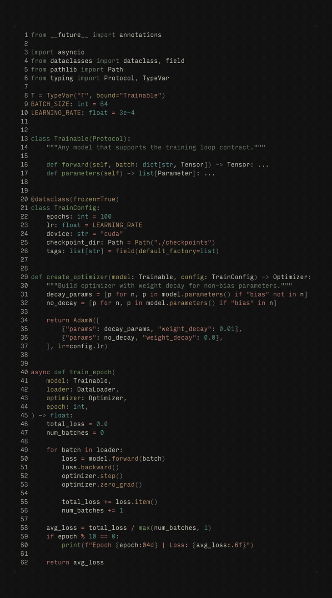
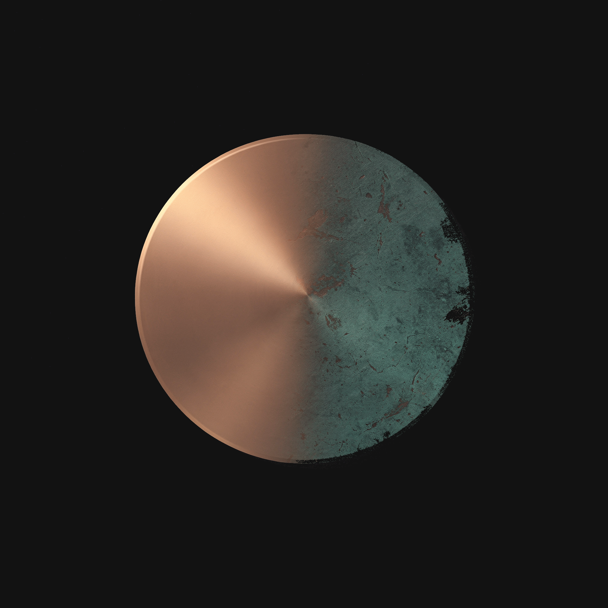
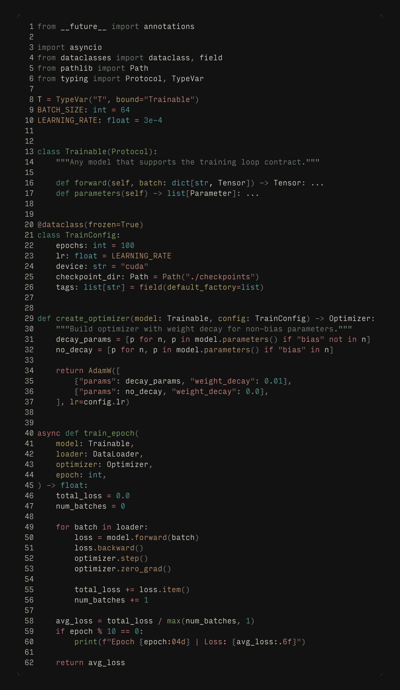
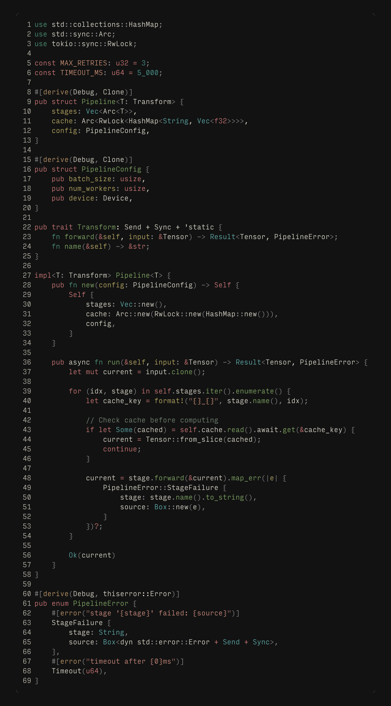

# Patina

A warm, muted color theme inspired by oxidized copper. Teal verdigris meets amber warmth on deep, quiet backgrounds.





## Variants

| Variant              | Background | Character                          |
| -------------------- | ---------- | ---------------------------------- |
| **Patina Dark**      | `#121212`  | Full contrast, deep black          |
| **Patina Dark Soft** | `#1a1a1a`  | Reduced contrast, gentler on eyes  |
| **Patina Light**     | `#ddd7c4`  | Warm parchment                     |
| **Patina Stellar**   | `#f5f2ed`  | Bright, airy                       |

## Syntax Highlighting





## Install

Search for **Patina** in the VS Code Extensions panel, or:

```
ext install LuisCMarkmann.patina-theme
```

## Recommended pairings

- **File icons:** [Carbon Icons](https://marketplace.visualstudio.com/items?itemName=AntFu.icons-carbon)
- **Font:** [Input](https://input.djr.com/) (Mono Narrow, Light weight)

## Also available for

| Editor / Terminal | Files | Install |
| --- | --- | --- |
| [Helix](https://helix-editor.com/) | `helix/` | Copy to `~/.config/helix/themes/` |
| [Neovim](https://neovim.io/) | `neovim/colors/` | Copy to `~/.config/nvim/colors/` |
| [IntelliJ](https://www.jetbrains.com/) | `intellij/` | Import via Settings > Editor > Color Scheme |
| [Alacritty](https://alacritty.org/) | `alacritty/` | Import in `~/.config/alacritty/alacritty.toml` |
| [Ghostty](https://ghostty.org/) | `ghostty/` | Copy to `~/.config/ghostty/themes/` |
| [Kitty](https://sw.kovidgoyal.net/kitty/) | `kitty/` | `include` in `~/.config/kitty/kitty.conf` |
| [WezTerm](https://wezfurlong.org/wezterm/) | `wezterm/` | Copy to `~/.config/wezterm/colors/` |
| [Zed](https://zed.dev/) | `zed/` | Copy to `~/.config/zed/themes/` |

## License

MIT
