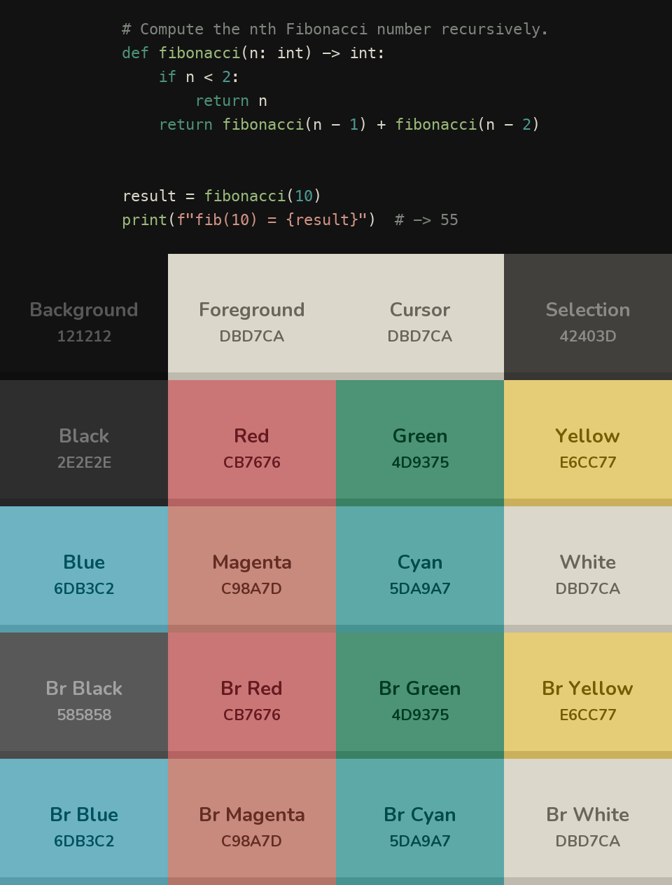
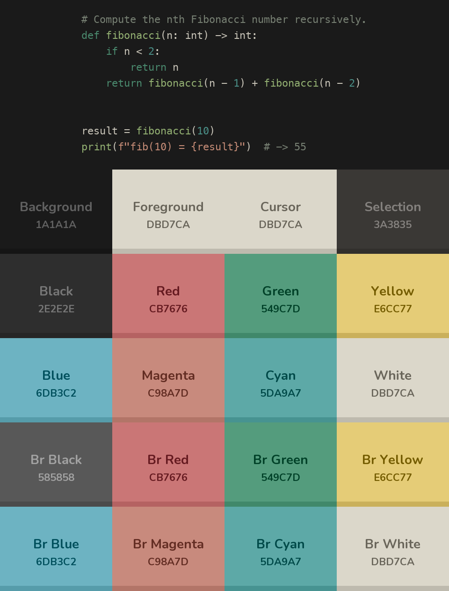
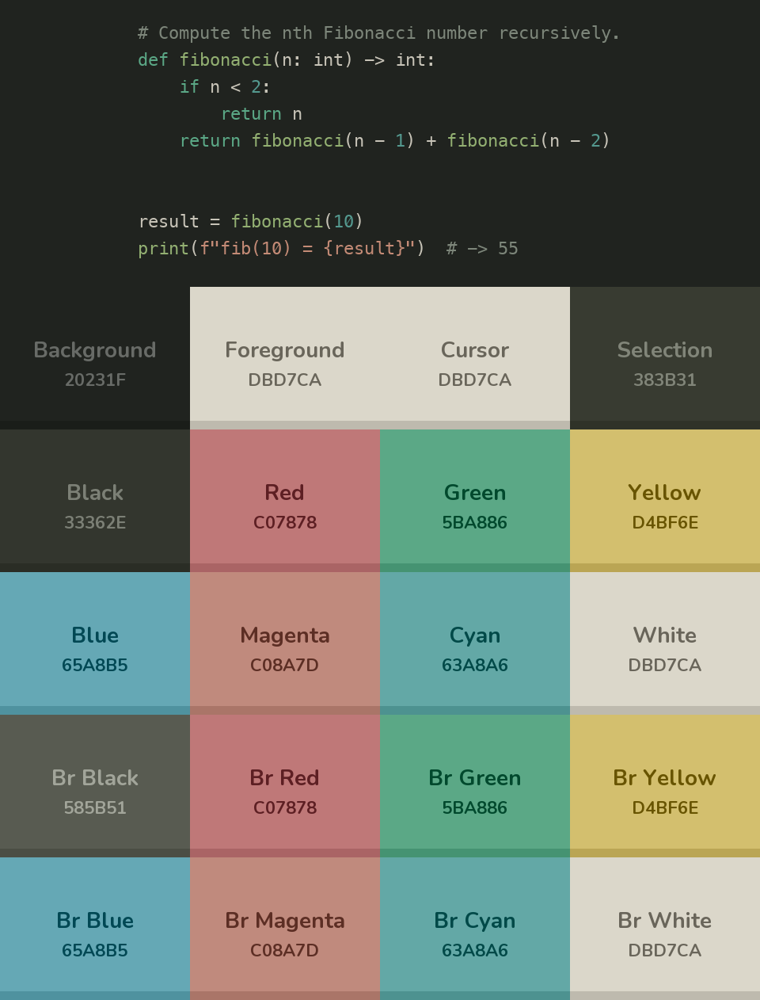
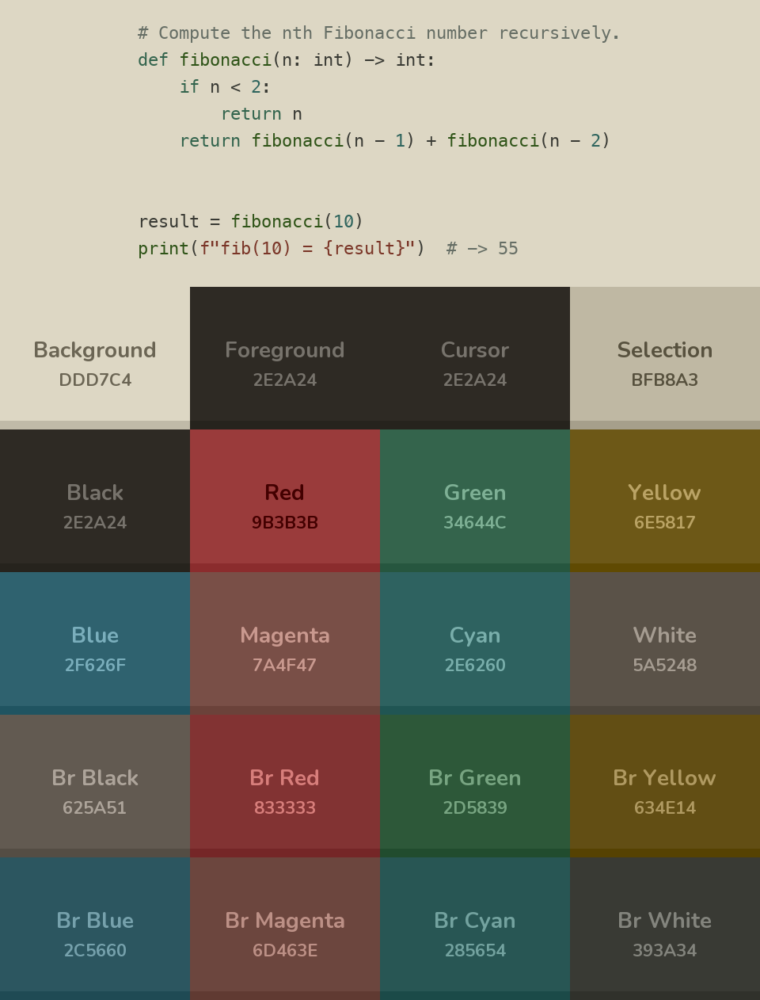
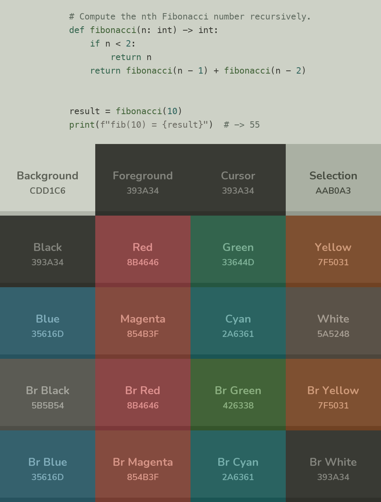
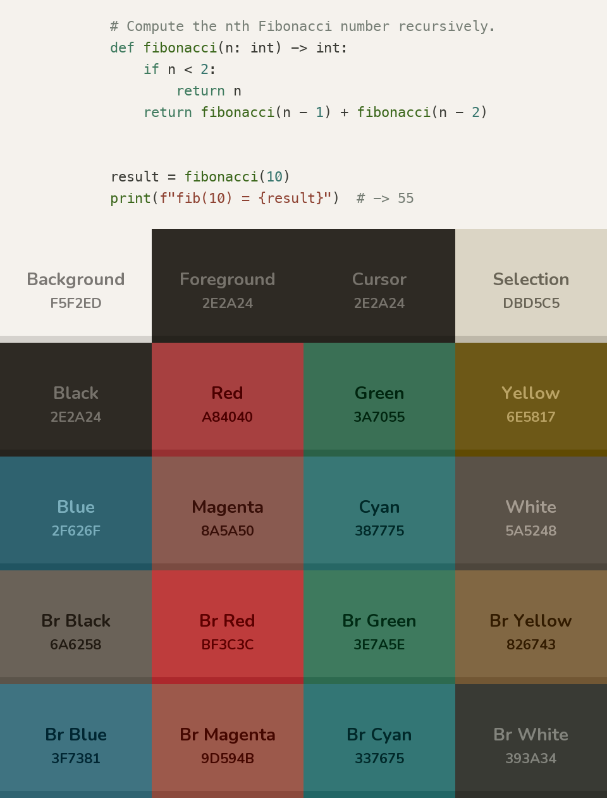

# Patina

A warm, muted color theme inspired by oxidized copper. Teal verdigris meets amber warmth on deep, quiet backgrounds.



## Variants

| Variant              | Background | Character                         |
| -------------------- | ---------- | --------------------------------- |
| **Patina Dark**      | `#121212`  | Full contrast, deep black         |
| **Patina Dark Soft** | `#1a1a1a`  | Reduced contrast, gentler on eyes |
| **Patina Moss**      | `#20231f`  | Dark, moss-tinted ground          |
| **Patina Light**     | `#ddd7c4`  | Warm parchment                    |
| **Patina Lichen**    | `#cdd1c6`  | Light, cool grey-green stone      |
| **Patina Stellar**   | `#f5f2ed`  | Bright, airy                      |

Patina Dark, Light, and Stellar pass WCAG AA contrast (4.5:1) on every syntax token except `markup.ignored`, which is intentionally blended with the background. Patina Dark Soft and Lichen intentionally soften a handful of tokens slightly below strict AA for reduced eye strain during long sessions.

### Previews








## Install

**VS Code / Cursor / VSCodium** — search for **Patina** in the Extensions panel, or:

```
ext install LuisCMarkmann.patina-theme
```

Also published on [Open VSX](https://open-vsx.org/extension/lmarkmann/patina-theme) for Cursor, VSCodium, and other open vsx compatible editors.

**Zed** — open the command palette, run `zed: install extension`, and search for **Patina**.

## Also available for

| Editor / Terminal                  | Files                   |
| ---------------------------------- | ----------------------- |
| [Ghostty](https://ghostty.org/)    | `terminals/ghostty/`    |
| [Helix](https://helix-editor.com/) | `helix-editor/`         |
| [iTerm2](https://iterm2.com/)      | `iterm2-color-schemes/` |

Copy the relevant files into your editor or terminal config directory.

I also recommend using the [Input Font](https://input.djr.com/) together with the themes.

## License

MIT
