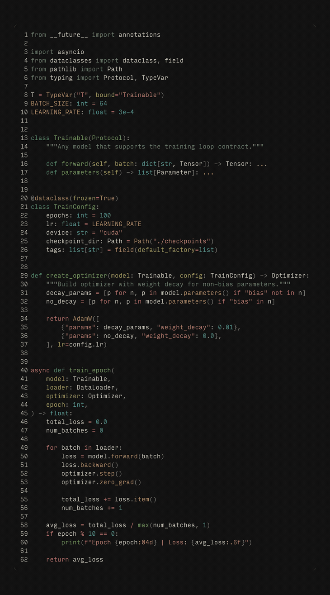
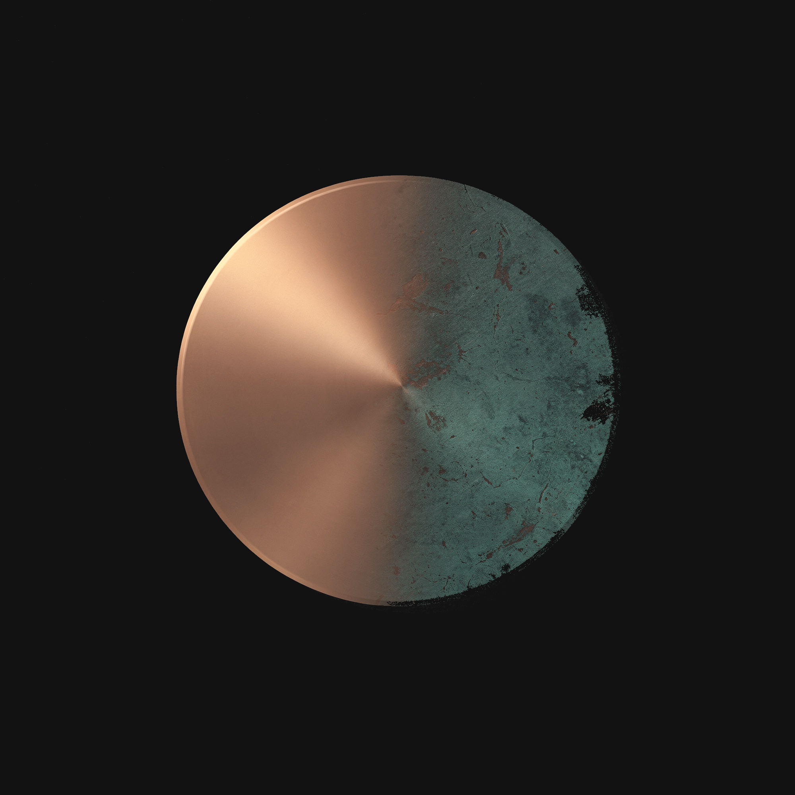
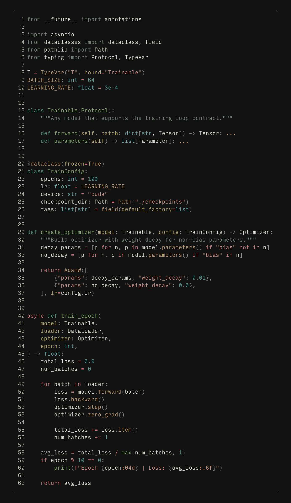
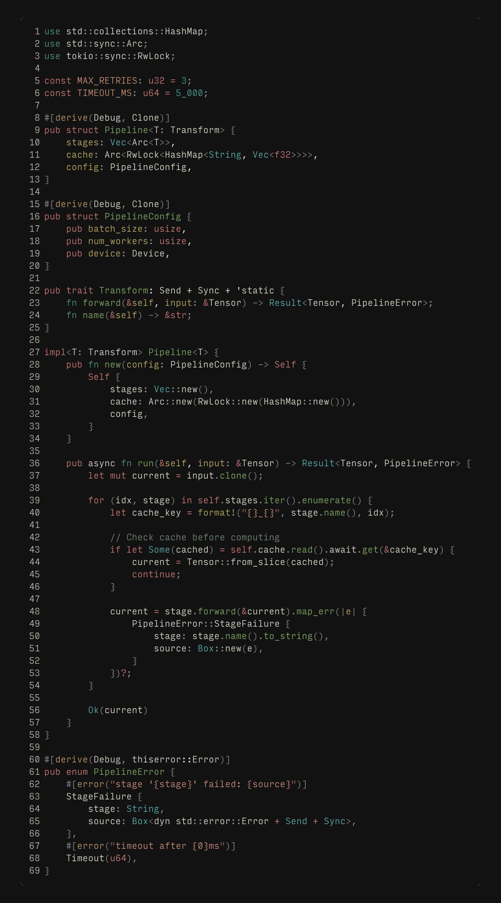

# Patina

A warm, muted color theme inspired by oxidized copper. Teal verdigris meets amber warmth on deep, quiet backgrounds.





## Variants

| Variant              | Background | Character                          |
| -------------------- | ---------- | ---------------------------------- |
| **Patina Dark**      | `#121212`  | Full contrast, deep black          |
| **Patina Dark Soft** | `#1a1a1a`  | Reduced contrast, gentler on eyes  |
| **Patina Light**     | `#ddd7c4`  | Warm parchment                     |
| **Patina Stellar**   | `#f5f2ed`  | Bright, airy                       |

Patina Dark, Light, and Stellar pass WCAG AA contrast (4.5:1) on every syntax token except `markup.ignored`, which is intentionally blended with the background. Patina Dark Soft intentionally softens four tokens slightly below strict AA for reduced eye strain during long sessions.

## Syntax Highlighting





## Install

**VS Code / Cursor / VSCodium** — search for **Patina** in the Extensions panel, or:

```
ext install LuisCMarkmann.patina-theme
```

Also published on [Open VSX](https://open-vsx.org/extension/lmarkmann/patina-theme) for Cursor, VSCodium, Gitpod, Theia, and other compatible editors.

## Also available for

| Editor / Terminal | Files | Install |
| --- | --- | --- |
| [Ghostty](https://ghostty.org/) | `terminals/ghostty/` | Copy to `~/.config/ghostty/themes/` |
| [Zed](https://zed.dev/) | `themes/patina.json` | `zed: install extension` -> "Patina", or copy to `~/.config/zed/themes/` |

## Recommended pairings

- **File icons:** [Carbon Icons](https://marketplace.visualstudio.com/items?itemName=AntFu.icons-carbon)
- **Font:** [Input](https://input.djr.com/) (Mono Narrow, Light weight)

## License

MIT
