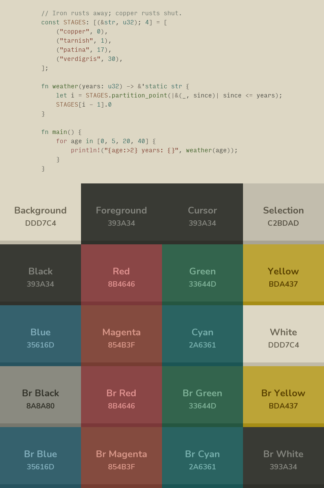

# Patina

[![open vsx][ovsx-badge]][ovsx] [![vs code][vscode-badge]][vscode] [![zed][zed-badge]][zed]

A warm, muted color theme inspired by oxidized copper. Teal verdigris meets amber warmth on deep, quiet backgrounds.

## Variants

| Variant              | Background | Character                         |
| -------------------- | ---------- | --------------------------------- |
| **Patina Dark**      | `#121212`  | Full contrast, deep black         |
| **Patina Dark Soft** | `#1a1a1a`  | Reduced contrast, gentler on eyes |
| **Patina Moss**      | `#20231f`  | Dark, moss-tinted ground          |
| **Patina Light**     | `#ddd7c4`  | Warm parchment                    |
| **Patina Lichen**    | `#cdd1c6`  | Light, cool grey-green stone      |
| **Patina Stellar**   | `#f5f2ed`  | Bright, airy                      |

Patina Dark, Light, and Stellar pass WCAG AA contrast (4.5:1) on every syntax token except `markup.ignored`, which is intentionally blended with the background. Patina Dark Soft and Lichen intentionally soften a handful of tokens slightly below strict AA for reduced eye strain.

### Previews

|                     **Patina Dark**                     |                       **Patina Dark Soft**                        |                     **Patina Moss**                     |
| :-----------------------------------------------------: | :---------------------------------------------------------------: | :-----------------------------------------------------: |
|         |         |         |
|                    **Patina Light**                     |                        **Patina Lichen**                         |                    **Patina Stellar**                    |
|        |          |        |

## Install

**VS Code / Cursor / VSCodium** search for **Patina** in the Extensions panel, or:

```
ext install LuisCMarkmann.patina-theme
```

Also published on [Open VSX](https://open-vsx.org/extension/lmarkmann/patina-theme) for Cursor, VSCodium, and other open vsx compatible editors.

**Zed** open the command palette, run `zed: install extension`, and search for **Patina**.

## Also available for

| Editor / Terminal                          | Files                           |
| ------------------------------------------ | ------------------------------- |
| [Ghostty](https://ghostty.org/)            | `terminals/ghostty/`            |
| [Yazi](https://github.com/sxyazi/yazi)     | `patina-<variant>.yazi/`        |
| [Helix](https://helix-editor.com/)         | `helix-editor/`                 |
| [iTerm2](https://iterm2.com/)              | `contrib/iterm2-color-schemes/` |

Copy the relevant files into your editor or terminal config directory. Yazi has a package manager, so it installs itself:

```sh
ya pkg add lmarkmann/patina-theme:patina-dark-soft
```

Then in `~/.config/yazi/theme.toml`:

```toml
[flavor]
dark = "patina-dark-soft"
light = "patina-light"
```

PRs porting Patina to other apps are welcome. The colors live in `palette/*.toml`, one file per variant; everything else in this repo is generated from them by `tools/generate.py`, so please don't hand-edit a theme file.

I also recommend the [Input Font](https://input.djr.com/) together with the themes; the previews above are set in it.

## License

MIT

[ovsx]: https://open-vsx.org/extension/lmarkmann/patina-theme
[vscode]: https://marketplace.visualstudio.com/items?itemName=LuisCMarkmann.patina-theme
[zed]: https://zed.dev/extensions/patina-theme
[ovsx-badge]: https://img.shields.io/open-vsx/dt/lmarkmann/patina-theme?label=open%20vsx&color=4d9375&logo=data%3Aimage%2Fsvg%2Bxml%3Bbase64%2CPHN2ZyB4bWxucz0iaHR0cDovL3d3dy53My5vcmcvMjAwMC9zdmciIHZpZXdCb3g9IjAgMCAxMDYgMTMzIj48cGF0aCBmaWxsPSIjYzE2MGVmIiBkPSJNMzAgNDQuMkw1Mi42IDVINy4zek00LjYgODguNWg0NS4zTDI3LjIgNDkuNHptNTEgMGwyMi42IDM5LjIgMjIuNi0zOS4yeiIvPjxwYXRoIGZpbGw9IiNhNjBlZTUiIGQ9Ik01Mi42IDVMMzAgNDQuMmg0NS4yek0yNy4yIDQ5LjRsMjIuNyAzOS4xIDIyLjYtMzkuMXptNTEgMEw1NS42IDg4LjVoNDUuMnoiLz48L3N2Zz4%3D
[vscode-badge]: https://badgen.net/vs-marketplace/i/LuisCMarkmann.patina-theme?label=vs%20code&labelColor=555&color=4d9375&icon=data%3Aimage%2Fsvg%2Bxml%3Bbase64%2CPHN2ZyB4bWxucz0iaHR0cDovL3d3dy53My5vcmcvMjAwMC9zdmciIHZpZXdCb3g9IjAgMCAyNCAyNCI%2BPHBhdGggZmlsbD0iI2ZmZmZmZiIgZD0iTTIzLjE1IDIuNTg3TDE4LjIxLjIxYTEuNDk0IDEuNDk0IDAgMCAwLTEuNzA1LjI5bC05LjQ2IDguNjMtNC4xMi0zLjEyOGEuOTk5Ljk5OSAwIDAgMC0xLjI3Ni4wNTdMLjMyNyA3LjI2MUExIDEgMCAwIDAgLjMyNiA4Ljc0TDMuODk5IDEyIC4zMjYgMTUuMjZhMSAxIDAgMCAwIC4wMDEgMS40NzlMMS42NSAxNy45NGEuOTk5Ljk5OSAwIDAgMCAxLjI3Ni4wNTdsNC4xMi0zLjEyOCA5LjQ2IDguNjNhMS40OTIgMS40OTIgMCAwIDAgMS43MDQuMjlsNC45NDItMi4zNzdBMS41IDEuNSAwIDAgMCAyNCAyMC4wNlYzLjkzOWExLjUgMS41IDAgMCAwLS44NS0xLjM1MnptLTUuMTQ2IDE0Ljg2MUwxMC44MjYgMTJsNy4xNzgtNS40NDh2MTAuODk2eiIvPjwvc3ZnPg%3D%3D
[zed-badge]: https://img.shields.io/badge/dynamic/json?url=https%3A%2F%2Fapi.zed.dev%2Fextensions%3Ffilter%3Dpatina-theme&query=%24.data%5B0%5D.download_count&label=zed&color=4d9375&logo=zedindustries&logoColor=white
