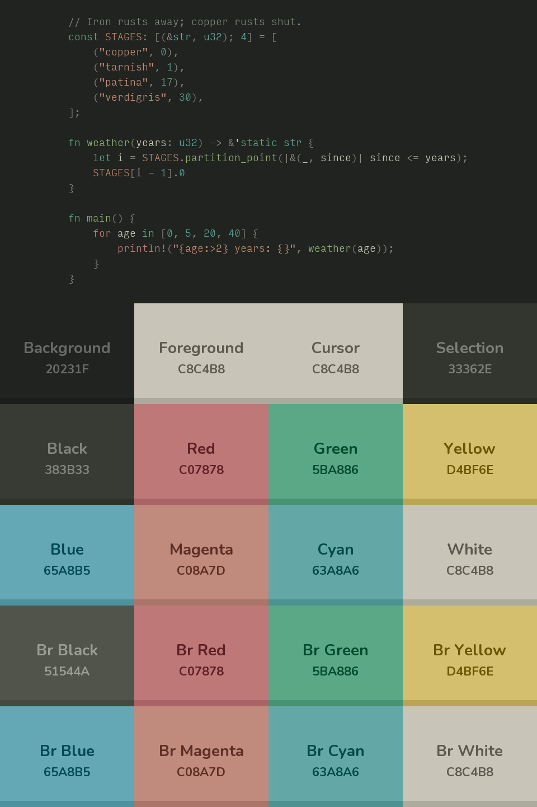

# patina-moss

A [Yazi](https://github.com/sxyazi/yazi) flavor from the **Patina** theme,
**Moss** variant.



Background `#20231f`, foreground `#c8c4b8`, accent `#5ba886`.

## Install

```sh
ya pkg add lmarkmann/patina-theme:patina-moss
```

Then in `~/.config/yazi/theme.toml`:

```toml
[flavor]
dark = "patina-moss"
```

Icons need a Nerd Font in your terminal; the flavor sets colours, not glyphs.

## Contents

- `flavor.toml` UI colours (file list, mode, status, tabs, which, help, notify)
- `tmtheme.xml` syntax colours for the file-preview pane

Generated from `palette/patina-moss.toml` in the Patina repo. MIT licensed.
