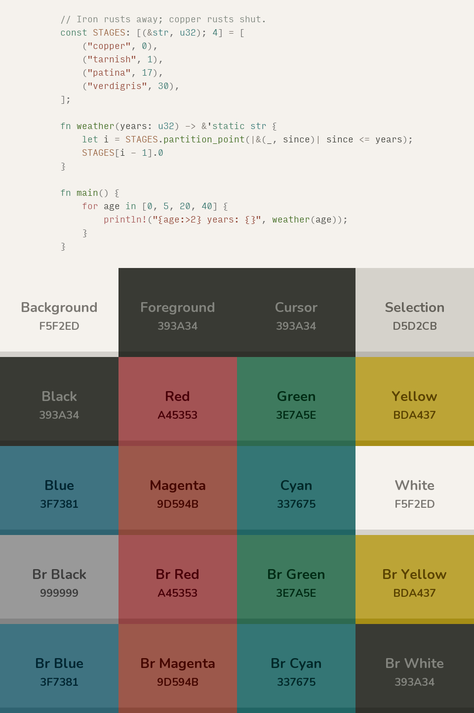

# patina-stellar

A [Yazi](https://github.com/sxyazi/yazi) flavor from the **Patina** theme,
**Stellar** variant.



Background `#f5f2ed`, foreground `#393a34`, accent `#3e7a5e`.

## Install

```sh
ya pkg add lmarkmann/patina-theme:patina-stellar
```

Then in `~/.config/yazi/theme.toml`:

```toml
[flavor]
light = "patina-stellar"
```

Icons need a Nerd Font in your terminal; the flavor sets colours, not glyphs.

## Contents

- `flavor.toml` UI colours (file list, mode, status, tabs, which, help, notify)
- `tmtheme.xml` syntax colours for the file-preview pane

Generated from `palette/patina-stellar.toml` in the Patina repo. MIT licensed.
